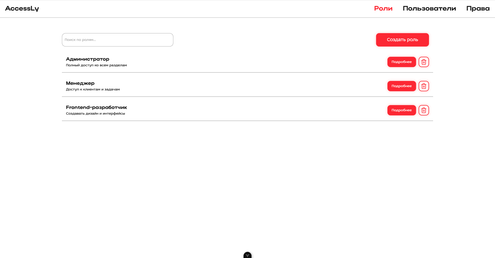
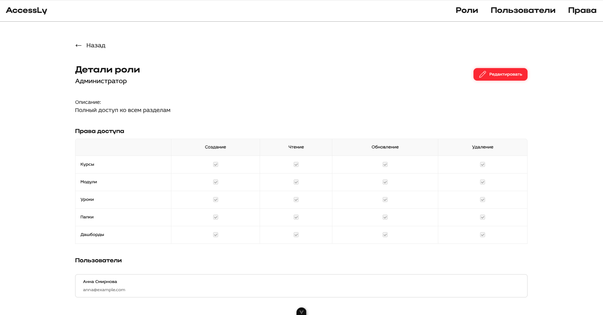
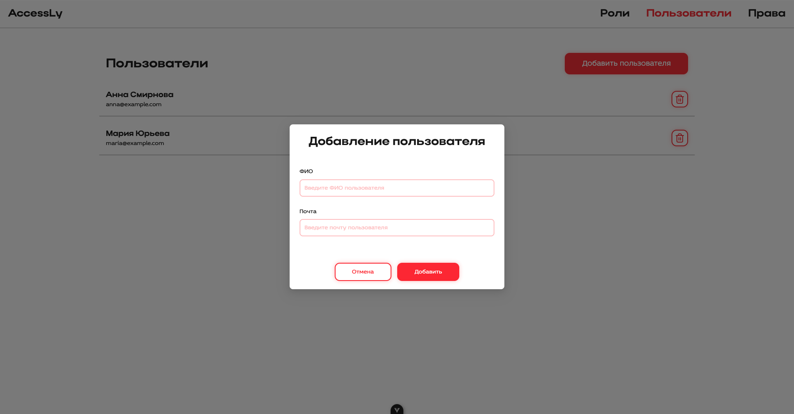

# Конструктор ролей (Vue 3)

Тестовое задание: интерфейс для создания, редактирования и просмотра ролей, доступов и пользователей.

---

## Стек технологий

- **Vue 3** + Composition API
- **TypeScript**
- **Pinia** — управление состоянием
- **Vue Router**
- **Ant Design Vue**
- **SCSS (SCOPED)**
- **VueUse** — вспомогательные хуки
- **lodash / isEqual** — сравнение данных
- **localStorage** — хранение мок-данных (через `useStorage`)

---

## Архитектура проекта (FSD)

Проект структурирован по **фичам и сущностям**:

```
src/
│
├── pages/ # Страницы (маршруты)
├── widgets/ # Крупные блоки, объединяющие фичи
├── features/ # Интерактивные фичи (формы, фильтры, триггеры)
├── entities/ # Модели: роли, пользователи, права
├── shared/ # Общие компоненты, стили и утилиты
└── app/ # Точка входа, маршруты и инициализация
```
---

## Возможности

- [x] Создание роли с названием и описанием
- [x] Создание пользователей и прав доступа
- [x] Привязка доступов (CRUD-права по сущностям)
- [x] Привязка пользователей
- [x] Страница с детальной информацией по роли
- [x] Фильтрация и поиск ролей
- [x] Визуальный статус изменений (`isChanged`)
- [x] Защита от потери данных (`beforeRouteLeave`)
- [x] Сброс изменений, сохранение, удаление

---

## Скриншоты

### Список ролей
Отображение всех ролей с фильтрацией и переходом к деталям.



---

### Детальная карточка роли
Редактирование названия, описания, доступов и пользователей.



---

### Управление доступами
Редактируемые права в формате таблицы.


---

### Добавление пользователей
Выбор пользователей из доступных и отображение закреплённых.



---

## Как запустить

```bash
npm install
npm run dev
```

Vite-сервер будет доступен на http://localhost:5173/
